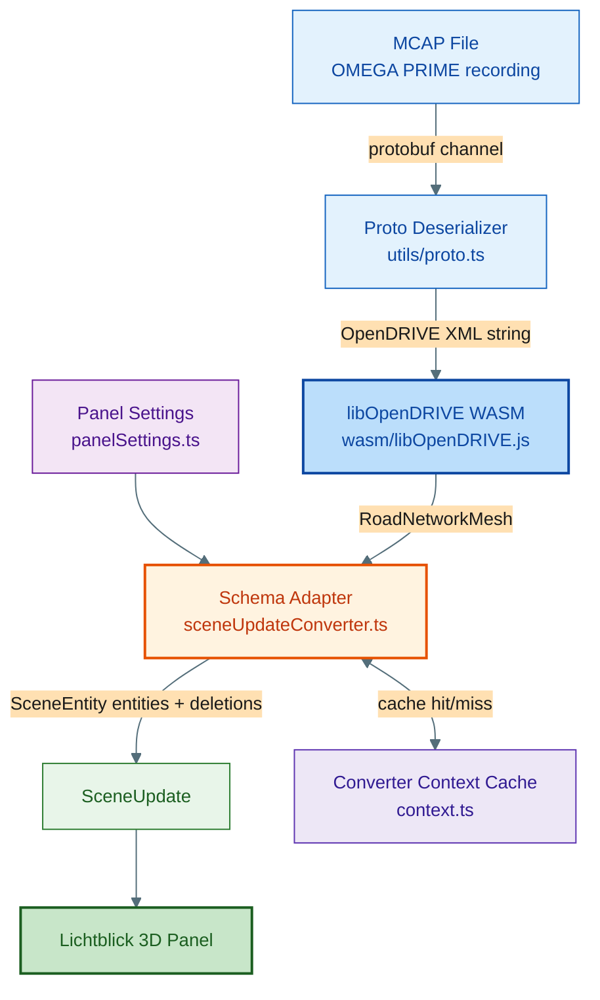

# Architecture Overview

## libOpenDRIVE WASM Architecture

This extension uses [libOpenDRIVE](https://github.com/pageldev/libOpenDRIVE/) compiled to **WebAssembly** as the only geometry engine. TypeScript extracts the OpenDRIVE XML, loads the WASM module, adapts the returned meshes to Foxglove `SceneUpdate`, and caches the result per map/settings combination.

### High-Level Flow



### Why libOpenDRIVE

1. **Standards-aligned geometry** — libOpenDRIVE handles line, arc, spiral, poly3, paramPoly3, and cubic bezier reference-line geometry together with elevation, superelevation, crossfall, lane offset, and lane height.
2. **Feature-complete meshes** — the WASM pipeline returns lane surfaces, lane outlines, road markings, road objects, and road signals as ready-to-adapt mesh data.
3. **Adaptive tessellation** — `get_road_network_mesh(eps)` uses an error-bounded tolerance instead of fixed-distance sampling.
4. **Single geometry kernel** — road topology and mesh generation live in one C++ codebase instead of being split across multiple TypeScript implementations.

### Runtime Responsibilities

- **`src/utils/proto.ts`** — defines the `MapAsamOpenDrive` message shape used by the converter.
- **`src/wasm/`** — lazy-loads the generated libOpenDRIVE module and exposes TypeScript typings for the Emscripten bindings.
- **`src/converters/openDriveMap/sceneUpdateConverter.ts`** — drives the XML → WASM → `SceneUpdate` conversion and builds Foxglove entities for all feature layers.
- **`src/converters/openDriveMap/context.ts`** — stores the cache key (`map_reference` + settings hash) and cached entities.
- **`src/converters/openDriveMap/panelSettings.ts`** — exposes layer toggles plus tessellation tolerance.
- **`src/utils/scene.ts`** — provides Foxglove primitive helpers and shared entity defaults.

## Current Module Structure

```text
src/
├── index.ts
├── config/
│   └── constants.ts
├── converters/
│   ├── index.ts
│   └── openDriveMap/
│       ├── context.ts
│       ├── panelSettings.ts
│       └── sceneUpdateConverter.ts
├── utils/
│   ├── proto.ts
│   └── scene.ts
└── wasm/
    ├── index.ts
    ├── types.ts
    └── libOpenDRIVE.js
```

## Design Principles

1. **Standards-based** — implementation and documentation reference ASAM OpenDRIVE V1.8.1 sections.
2. **WASM-first** — libOpenDRIVE performs geometry parsing, topology handling, and mesh generation.
3. **Thin TypeScript adapter** — the extension focuses on deserialization, schema mapping, and panel integration.
4. **Cache-aware** — identical `map_reference` and rendering settings reuse the same generated entities.
5. **Foxglove-native output** — the final artifact is a `SceneUpdate` with stable entity IDs and explicit deletions on settings changes.
