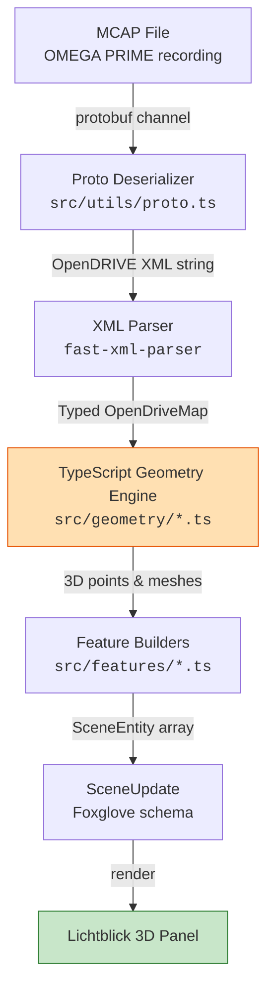
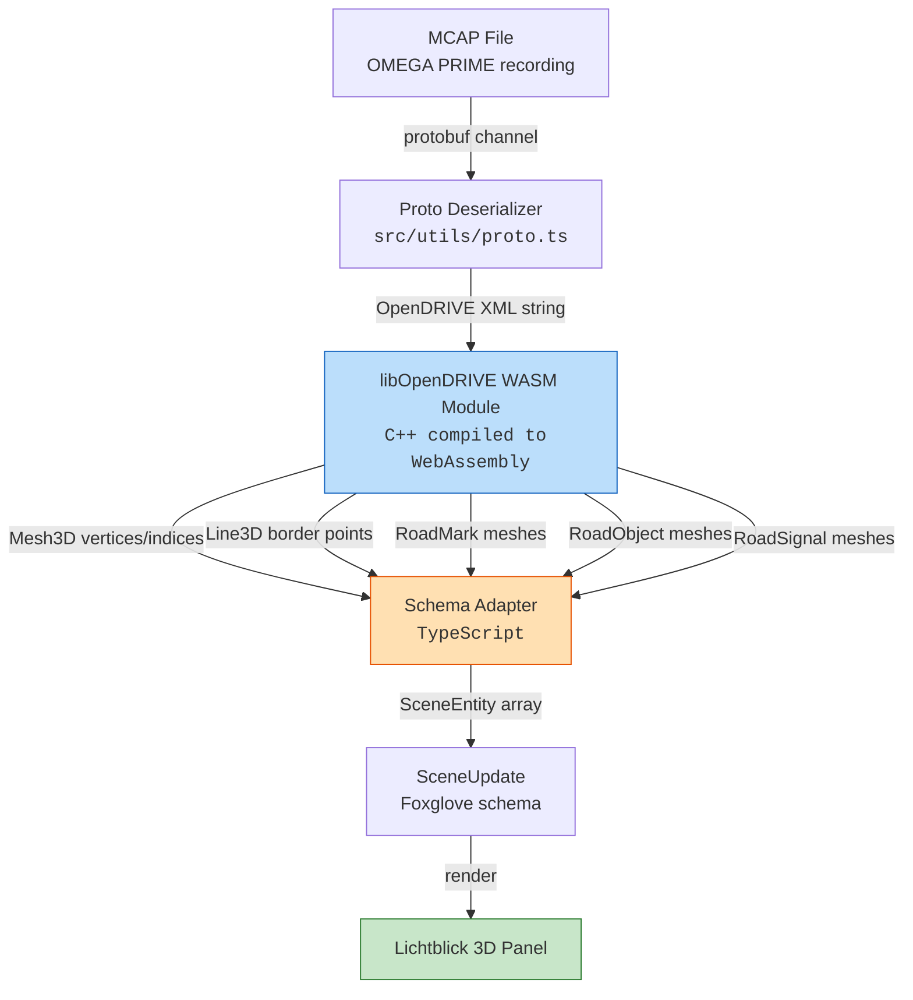
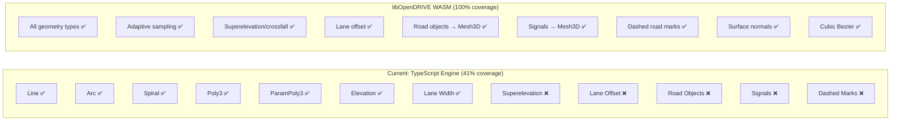
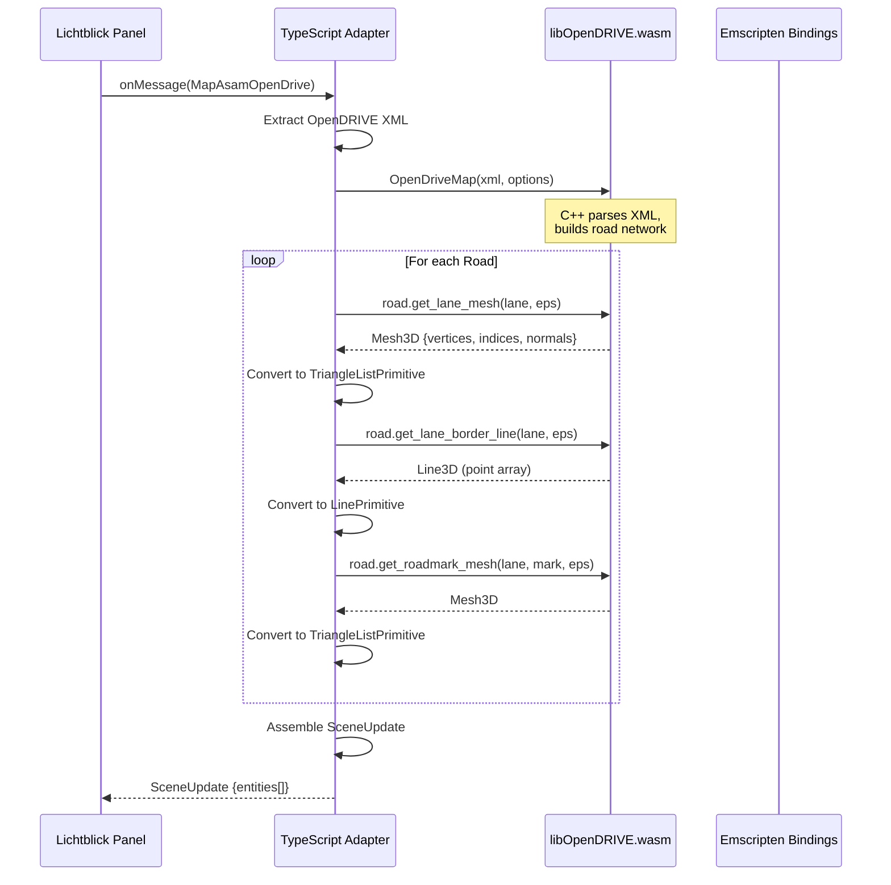
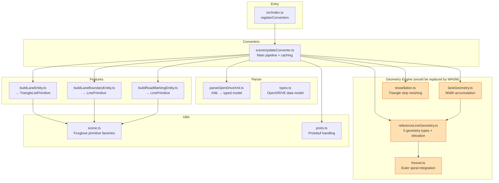

# Architecture Overview

## Current vs Future Architecture

This extension currently uses a **pure TypeScript geometry engine** that reimplements OpenDRIVE geometry evaluation. The [libOpenDRIVE](https://github.com/pageldev/libOpenDRIVE/) C++ library is the reference implementation we validated against — a future version may integrate it as a **WASM module** to gain full feature coverage without reimplementing complex algorithms.

### Current Architecture (Pure TypeScript)

**Limitation:** Our TypeScript engine only covers ~41% of OpenDRIVE features (no superelevation, no objects/signals, no adaptive sampling, no dashed markings).

### Future Architecture (with libOpenDRIVE WASM)

**Benefit:** libOpenDRIVE handles ALL geometry computation in optimized C++ — we only need a thin TypeScript adapter to map its output meshes to Foxglove schema.

## Why libOpenDRIVE WASM Would Be Useful

| Aspect | Current (TypeScript) | Future (WASM) |
|--------|---------------------|---------------|
| **Feature coverage** | 41% of OpenDRIVE | ~95% |
| **Performance** | JS numeric integration | Compiled C++ (5-10× faster) |
| **Sampling** | Fixed 1m steps | Adaptive error-bounded |
| **Maintenance** | We maintain geometry code | Community-maintained library |
| **Bundle size** | ~15KB (source only) | ~200-400KB (WASM binary) |
| **Accuracy** | Simpson's rule approximation | Native double precision |

## How WASM Integration Would Work

The C++ library does all the heavy computation (geometry evaluation, tessellation, mesh generation). TypeScript only:
1. Passes in the XML string
2. Calls the C++ API via Emscripten bindings
3. Maps the returned `Mesh3D`/`Line3D` data to Foxglove schema types

## Current Module Structure

The orange-highlighted modules (`src/geometry/*`) are the ones that would be **replaced** by libOpenDRIVE WASM calls. Everything else (parser, features, utils) stays as TypeScript.

## Design Principles

1. **Standards-based** — Every implementation references ASAM OpenDRIVE V1.8.1 section numbers
2. **WASM-ready** — Geometry engine is isolated so it can be swapped for C++ WASM module
3. **Stateless conversion** — Each `SceneUpdate` is self-contained (no incremental state)
4. **Cache-friendly** — Identical maps produce identical output (memoized by reference)
5. **Foxglove-native** — Direct mapping to `SceneEntity` primitives without intermediate formats
