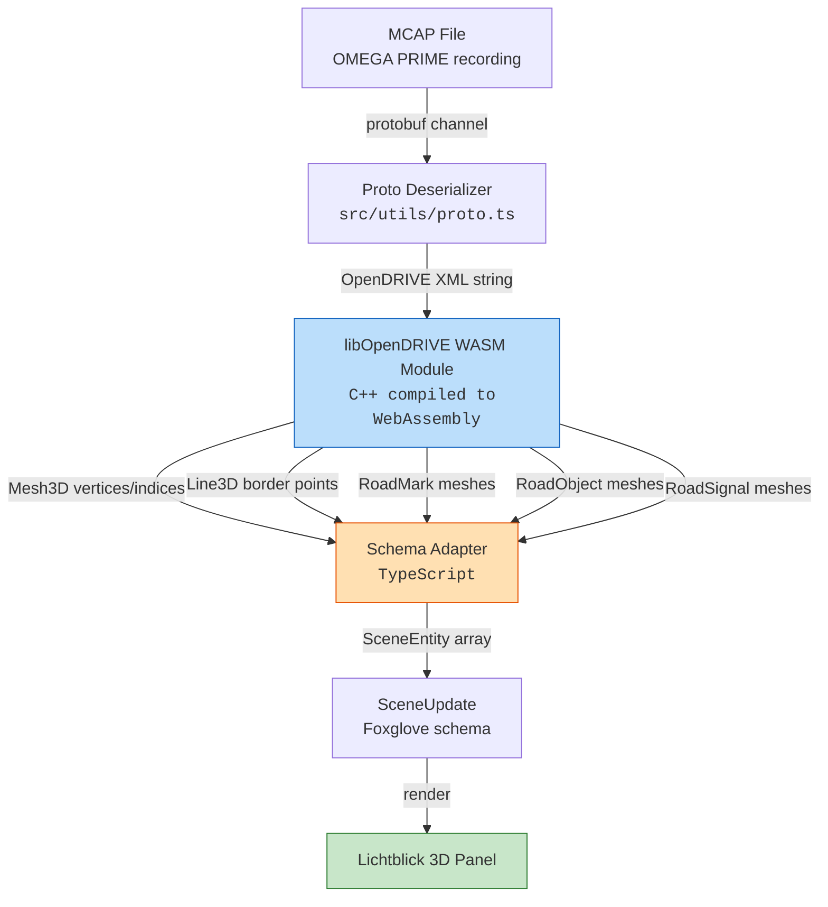
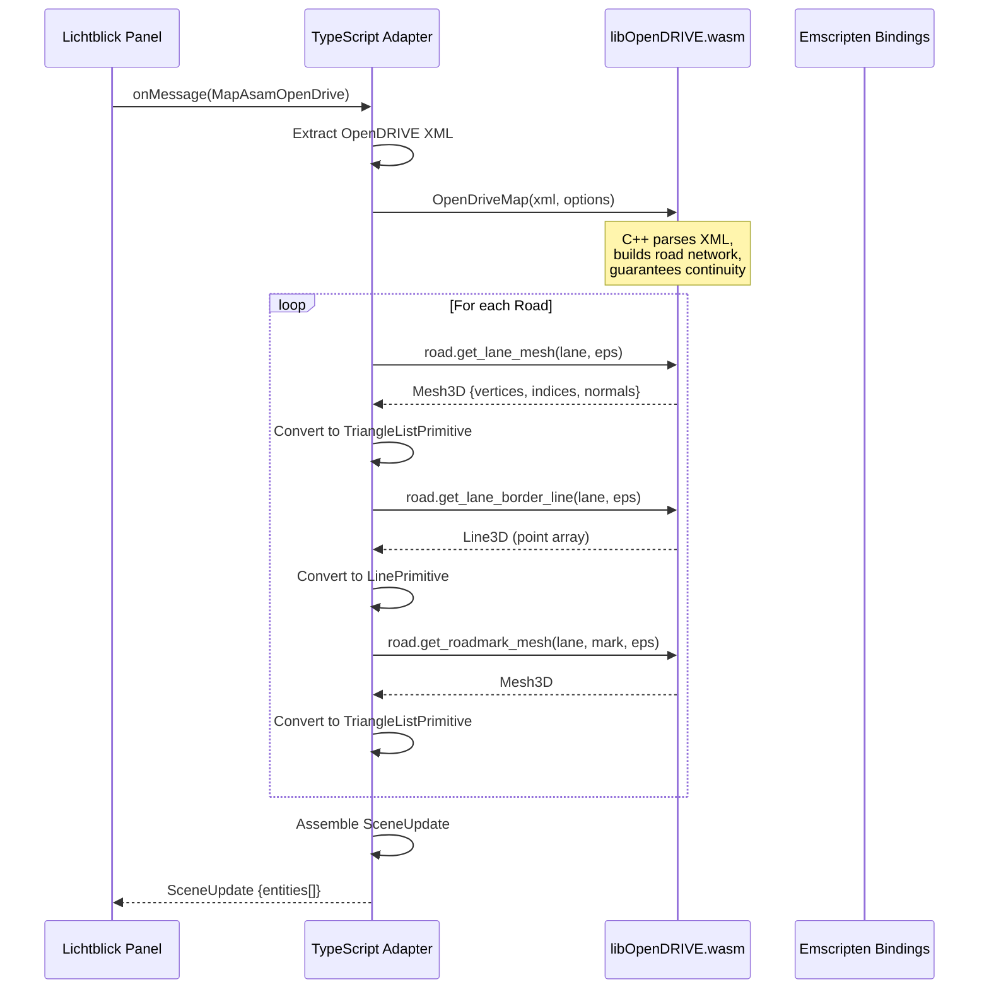
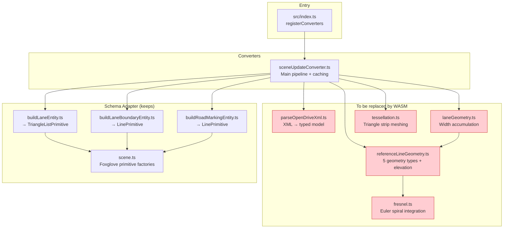

# Architecture Overview

## Target Architecture: libOpenDRIVE WASM

This extension uses [libOpenDRIVE](https://github.com/pageldev/libOpenDRIVE/) compiled to **WebAssembly** as its geometry and tessellation kernel. The C++ library handles all OpenDRIVE geometry evaluation, lane computation, and mesh generation — the TypeScript layer only adapts its output to Foxglove schema.

> **Current state:** An interim TypeScript geometry engine is in place while the WASM integration is being completed. It has known visual issues (segment discontinuities) that the C++ library solves correctly.

### Architecture (with libOpenDRIVE WASM)

### Why libOpenDRIVE (not custom TypeScript)

The C++ library is the authoritative choice because:

1. **Correct by construction** — implements the full OpenDRIVE standard including geometry continuity guarantees [ODR §9.2], lane offset [ODR §11.4], superelevation, adaptive sampling
2. **Community-maintained** — actively developed, tested against real-world OpenDRIVE files
3. **Performance** — compiled C++ is 5-10× faster than equivalent JS numeric integration
4. **Feature-complete** — road objects, signals, dashed markings, cubic Bezier, all geometry types

| Aspect | libOpenDRIVE WASM | Interim TypeScript |
|--------|-------------------|-------------------|
| **Feature coverage** | ~95% of OpenDRIVE | 41% |
| **Geometry continuity** | Guaranteed (uses spec start positions) | Discontinuities at junctions |
| **Sampling** | Adaptive error-bounded | Fixed 1m steps |
| **Lane offset** | Full cubic profile support | Not applied |
| **Road marks** | Dashed patterns with length/space | Continuous lines only |
| **Objects/Signals** | Full 3D mesh generation | Not implemented |

### How WASM Integration Works

The C++ library does **all** geometry computation (reference line evaluation, lane boundary calculation, tessellation, road mark meshing). TypeScript only:
1. Passes in the XML string
2. Calls the C++ API via Emscripten bindings
3. Maps the returned `Mesh3D`/`Line3D` data to Foxglove schema types

### Why the Interim TypeScript Has Visual Bugs

Per [ODR §9.2], the standard guarantees:
- `refline_no_gaps` — reference lines have no gaps within a road
- `refline_no_kinks` — reference lines are C1 continuous (tangent-continuous)
- Lane linkage [ODR §11.5] — lanes connected across sections must use `<link>` predecessor/successor

The TypeScript engine violates these by:
- Not using `<laneOffset>` [ODR §11.4] to shift the center lane
- Rendering each road/section independently without honoring lane links
- Using fixed step size instead of adaptive sampling (misses tight curves)
- Not using the road network topology (predecessor/successor) to ensure visual continuity at junctions

libOpenDRIVE handles ALL of these correctly because it builds the full road network graph and computes geometry with proper continuity constraints.

## Current Module Structure

Red-highlighted modules will be **replaced** by libOpenDRIVE WASM calls. The schema adapter (feature builders, scene utilities) stays as TypeScript.

## Design Principles

1. **Standards-based** — Every implementation references ASAM OpenDRIVE V1.8.1 section numbers
2. **WASM kernel** — libOpenDRIVE C++ handles all geometry; TypeScript adapts to Foxglove
3. **Stateless conversion** — Each `SceneUpdate` is self-contained (no incremental state)
4. **Cache-friendly** — Identical maps produce identical output (memoized by reference)
5. **Foxglove-native** — Direct mapping to `SceneEntity` primitives without intermediate formats
